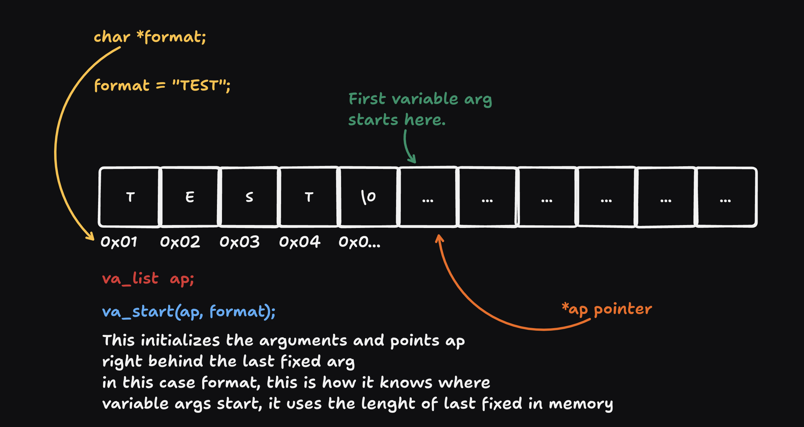
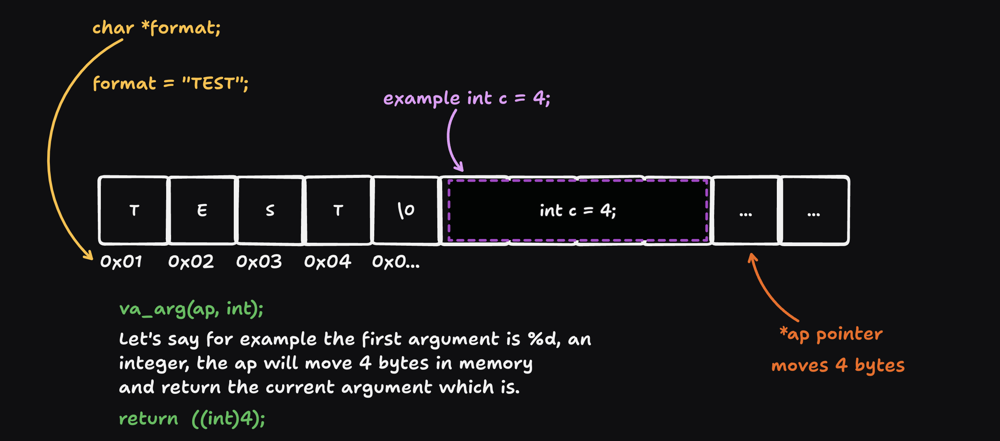

---
# FT_PRINTF

In this project we are tasked with recreating the printf function, and are introduced to a new\
concept in c, which is variadic functions. in this documentation i will walk through my journey \
coding this function and explain what variadic functions are and how they are useful when\
creating a function that accepts a variable number of arguments.

## Variadic functions:

They are functions that can take a variable number of arguments.\
in order to utilize variadic functions, one must include the `stdarg.h` header.\

This gives access to the **va_list** datatype, it is a `special datatype` in c, and is represented\
often as a `struct,` or a simple `pointer`, that handles and abstracts the mechanism that keeps\
track of the variable args in memory.

Lets dive into the details a bit:

---
### Va_list:
to simplify understanding how `va_list` works at first, let's just say it works a simple pointer.\
Lets say we declare a variable ap, that is of type va_list:
```c
#include <stdarg.h>
va_list ap; // va_list pointer called (ap -> argument pointer).
```

heres how printf is prototyped just to use it as an example:
```c
int ft_printf(char *format, ...); //printf example
{
	//below everything will be explained in images.
	va_list ap; 
	//creates argument pointer // right now deosnt point to anything
	va_start(ap,  format); 
	// initalizes variable arguments.
	//and points to the first one
}
```

#### char \*format:
It takes at-least one fixed argument, the reason for this is how it will know exactly\
where the variable arguments begin in memory using the fixed arg `format string`\
it uses address and size in bytes to reach the end of it, which will be the start of our first\
variable arg.
#### ( ... ) :
This is called an ellipsis , it tells the compiler that this function accepts a variable number of \
arguments.

### va_start(ap,  format);

va_start() is a macro, that expands into a built in function, that handles the following mechanism\
we use the va_start() macro to initialize the variable arguments comming rom the main function 



Now here is where the va_arg() macro comes into play.
#### va_arg(ap, type);

va_arg() is a macro that expands into a built in functionm that fetches the current variable \
argument `it returns it`, and moves the pointer forward.

It takes the argument pointer `va_list ap;`, and the type of the current arg\
This is how it knows how mush to move forward in memory to reach the next arg.


